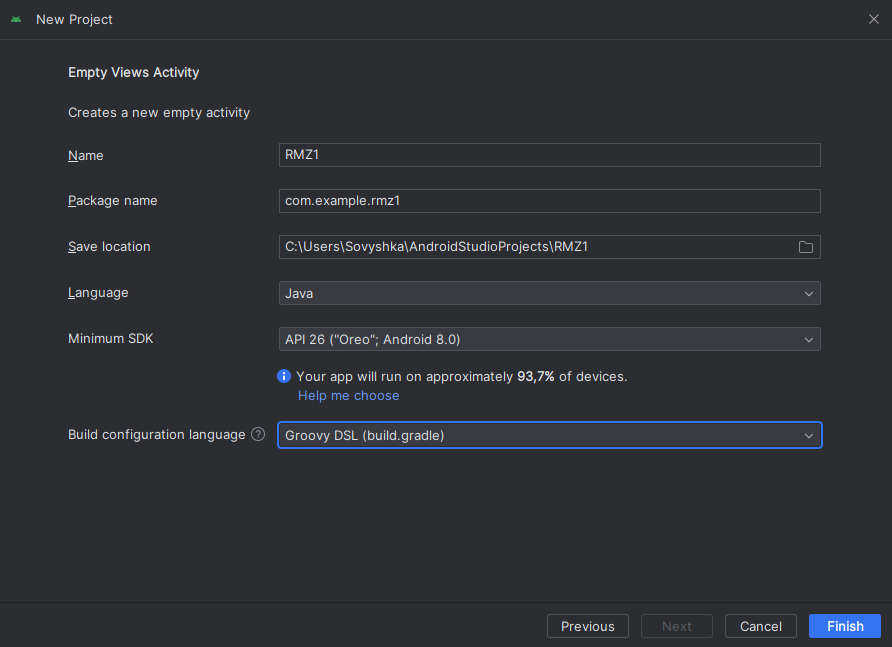
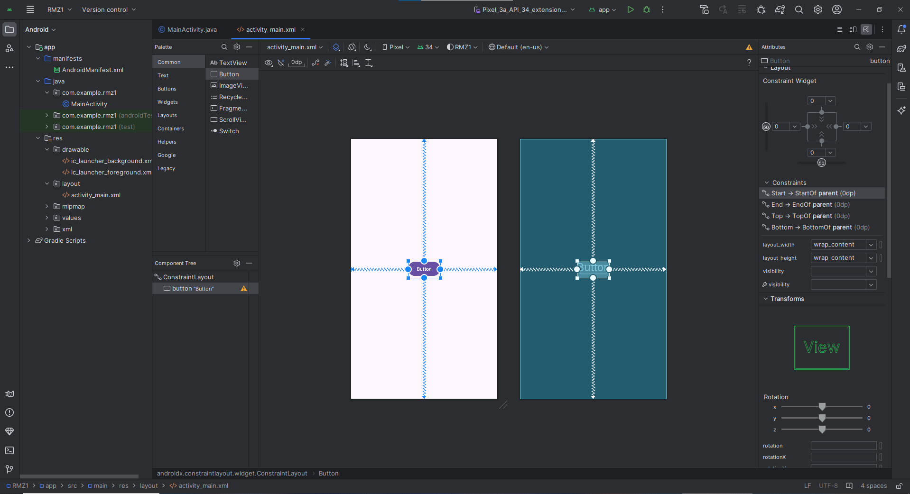
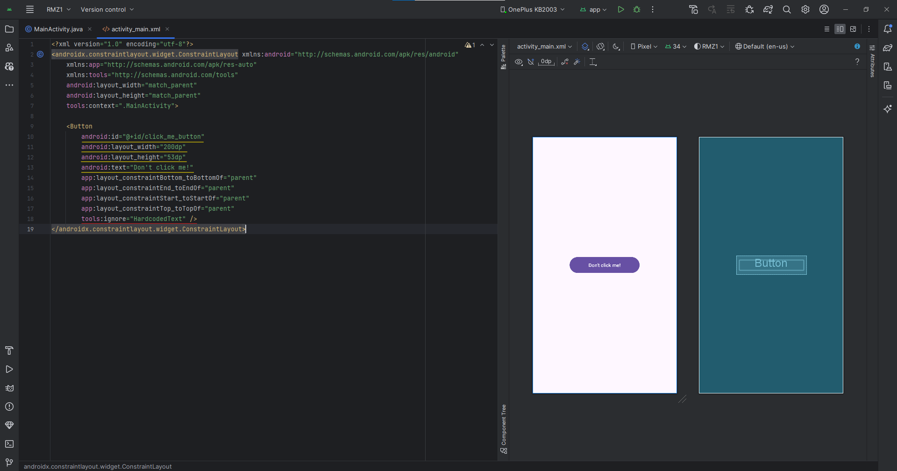

# Розробка мобільних застосунків

# Практична робота №1.2

### 1. Створення проектy
- Створюю проект з API26 для Android 8 "Oreo" 
<p>
  
</p>

### 2. Налаштування інтерфейсу застосунку
- Додаю кпонку, та вирівнюю її по центру
<p>
  
</p>

- В файлі ``` \app\src\main\res\layout\activity_main.xml ```, змінюю такі параметри
  
```java
android:id="@+id/click_me_button" -- змінюю id об'єкту
android:layout_width="200dp" -- змінюю ширину об'єкту
android:layout_height="53dp" -- змінюю висоту об'єкту
android:text="Don't click me!" -- змінюю текст об'єкту
tools:ignore="HardcodedText" -- додаю параметр для ігнорування "хардкод-тексту"
```

<p>
  
</p>

### 3. Написання коду
3.1 Створюю змінні
```java
private Button button; // змінна для кнопки
private boolean styleFlag = false; // змінна-перемикач для стилю кнопки
private boolean exitFlag = false; // змінна для виходу з додатку
```

3.2. Для методу ``` OnCreate() ```

```java
@Override
protected void onCreate(Bundle savedInstanceState) {
    super.onCreate(savedInstanceState);
    setContentView(R.layout.activity_main);

    button = findViewById(R.id.click_me_button); // находжу кнопку за заданим id раніше
    button.setOnClickListener(new View.OnClickListener() {
        // Встановлюємо слухач подій натискання на кнопку
        @Override
        public void onClick(View v) {
            // При натисканні на кнопку викликається метод handleButtonClick()
            handleButtonClick();
        }
    });
}
```

3.3 Функція ```handleButtonClick()```
```java
private void handleButtonClick() {
    // Перевіряємо, чи встановлено прапорець стилю
    if (!styleFlag) {
        // Якщо встановлено прапорець виходу
        if (exitFlag) {
            showToast("Я з вами покінчив!", Toast.LENGTH_LONG);
            finish();  // Завершуємо активність (Activity)
        }

        // Встановлюємо стиль для кнопки
        setButtonStyle(button, Color.BLACK, Color.WHITE, "Більше не натискай на мене!");

        showToast("Привіт, чому ти на мене натискав?!", Toast.LENGTH_SHORT);
        styleFlag = !styleFlag;  // Змінюємо значення прапорця стилю
    }
    else {
        // Змінюємо стиль кнопки при іншому стані прапорця стилю
        setButtonStyle(button, Color.WHITE, Color.BLACK, "Чувак, ти не серйозний");

        styleFlag = !styleFlag;  // Змінюємо значення прапорця стилю
        exitFlag = !exitFlag;    // Змінюємо значення прапорця виходу
    }
}
```

3.4 Функція ```setButtonStyle(Button, int, int, string)``` та ```showToast(String, int) ```
```java
private void setButtonStyle(Button btn, int backgroundColor, int textColor, String buttonText) {
    btn.setBackgroundColor(backgroundColor); // Встановлюємо колір фону кнопки
    btn.setTextColor(textColor); // Встановлюємо колір тексту кнопки
    btn.setText(buttonText); // Встановлюємо текст кнопки
}
```
```java
private void showToast(String message, int duration) {
    Toast.makeText(this, message, duration).show(); // Створюємо і відображаємо повідомлення Toast з вказаним текстом і тривалістю
}
```

4. Робочий додаток
<p>
  
</p>
